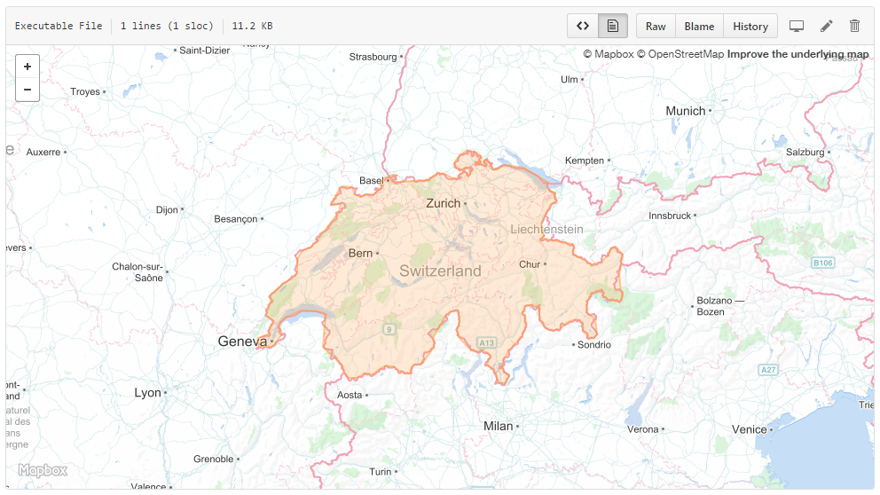

# Countries
## A Laravel Countries package, with lots of information  

[](https://packagist.org/packages/pragmarx/countries) [](LICENSE) [](https://scrutinizer-ci.com/g/antonioribeiro/countries/?branch=master) [](https://travis-ci.org/antonioribeiro/countries) [](https://styleci.io/repos/74829244) <!--- [](https://packagist.org/packages/pragmarx/countries) -->

### Geoology and Topology for countries

Amongst many other information you'll be able to plot country maps:



### What does it gives you?

This package is a collection of some other packages with information on:

- Countries
    - name (common and native)
    - currency
    - languages
    - states
    - timezone
    - flags (sprites, flag icons, svg)
    - tld
    - multiple ISO codes
    - calling code
    - capital
    - alternate spellings
    - region & sub region
    - translations (country name translated to some other languages)
    - latitude and logitude
    - borders (countries) - you can hydrate those borders (like relatioships)
    - area
    - topology 
    - geometry

- Currencies
    - sign
    - ISO codes
    - title
    - subunits
    - usage (dates)
    
- States 
    - adm codes
    - name & alt name
    - type (state, city, province, canton, department, district, etc.)
    - latitude & longitude
    - language
    - (and many more)

- Flags. There are some options available out there, so this package will give you some:
    - sprite, based on [https://www.flag-sprites.com/](https://www.flag-sprites.com/)
    - flag-icon and flag-icon-squared, based on [https://github.com/lipis/flag-icon-css](https://github.com/lipis/flag-icon-css)
    - world-flags-sprite, based on [https://github.com/lafeber/world-flags-sprite](https://github.com/lafeber/world-flags-sprite)
    - svg, the flag svg file loaded into the json
  
## Usage
 
The package is based on Laravel Collections, so you basically have access to all methods in Collections, like 

    $all = Countries::all();
     
This filter

    Countries::where('name.common', 'Brazil')

Will find Brazil by its common name, which is a 

      #items: array:22 [▼
        "name" => array:3 [▼
          "common" => "Brazil"
          "official" => "Federative Republic of Brazil"
          "native" => array:1 [▼
            "por" => array:2 [▼
              "official" => "República Federativa do Brasil"
              "common" => "Brasil"
            ]
          ]
        ]
        
And, you can go deepeer
         
     Countries::where('name.native.por.common', 'Brasil')
     
Or search by the country top level domain
     
     Countries::where('tld.0', '.ch')
     
To get

    "name" => array:3 [▼
      "common" => "Switzerland"
      "official" => "Swiss Confederation"
      "native" => array:4 [▶]
    ]
    "tld" => array:1 [▼
      0 => ".ch"
    ]
    
And use things like pluck

    Countries::where('cca3', 'USA')->first()->states->pluck('name', 'postal')

To get

    "MA" => "Massachusetts"
    "MN" => "Minnesota"
    "MT" => "Montana"
    "ND" => "North Dakota"
    "HI" => "Hawaii"
    "ID" => "Idaho"
    "WA" => "Washington"
    "AZ" => "Arizona"
    "CA" => "California"
    "CO" => "Colorado"
    "NV" => "Nevada"
    "NM" => "New Mexico"
    "OR" => "Oregon"
    "UT" => "Utah"
    "WY" => "Wyoming"
    "AR" => "Arkansas"
    "IA" => "Iowa"
    "KS" => "Kansas"
    "MO" => "Missouri"
    "NE" => "Nebraska"
    "OK" => "Oklahoma"
    "SD" => "South Dakota"
    "LA" => "Louisiana"
    "TX" => "Texas"
    "CT" => "Connecticut"
    "NH" => "New Hampshire"
    "RI" => "Rhode Island"
    "VT" => "Vermont"
    "AL" => "Alabama"
    "FL" => "Florida"
    "GA" => "Georgia"
    "MS" => "Mississippi"
    "SC" => "South Carolina"
    "IL" => "Illinois"
    "IN" => "Indiana"
    "KY" => "Kentucky"
    "NC" => "North Carolina"
    "OH" => "Ohio"
    "TN" => "Tennessee"
    "VA" => "Virginia"
    "WI" => "Wisconsin"
    "WV" => "West Virginia"
    "DE" => "Delaware"
    "DC" => "District of Columbia"
    "MD" => "Maryland"
    "NJ" => "New Jersey"
    "NY" => "New York"
    "PA" => "Pennsylvania"
    "ME" => "Maine"
    "MI" => "Michigan"
    "AK" => "Alaska"
          
The package uses a modified Collection which allows you to access properties and methods as objects:
         
    Countries::where('cca3', 'FRA')
        ->first()
        ->borders
        ->first()
        ->name
        ->official
    
Should give
    
    Principality of Andorra
         
Borders hydration is disabled by default, but you can have your borders hydrated easily by calling the hydrate method:
 
    Countries::where('name.common', 'United Kingdom')
        ->hydrate('borders')
        ->first()
        ->borders
        ->reverse()
        ->first()
        ->name
        ->common

Should return 

    Ireland

## Cache

Since this data is not supposed to change, calls are automatically cached, but you can changed that.  

## Sample files

- [sample-partial.json](src/data/sample-partial.json): example of a country with no borders hydrated.
- [sample-full.json](src/data/sample-full.json): example of a fully hydrated country.

## Requirements

- PHP 7.0+
- Laravel 5.3+

## Installing

Use Composer to install it:

    composer require pragmarx/countries

## Installing on Laravel

Add the Service Provider and Facade alias to your `app/config/app.php` (Laravel 4.x) or `config/app.php` (Laravel 5.x):
    
    ```php
    // config/app.php

    'providers' => [
        ...
        PragmaRX\Countries\ServiceProvider::class,
    ];

    'aliases' => [
        ...
        'Countries'=> PragmaRX\Countries\Facade::class,
    ];
    ```

## Author

[Antonio Carlos Ribeiro](http://twitter.com/iantonioribeiro)

## License

Countries is licensed under the BSD 3-Clause License - see the `LICENSE` file for details

## Contributing

Pull requests and issues are more than welcome.
